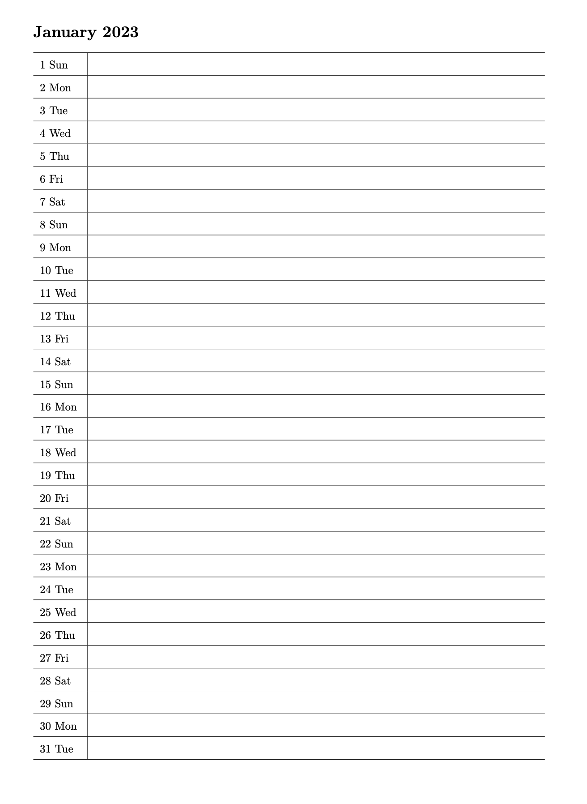

# monthsheets

RMarkdown & Quarto documents for creating printable sheets with entries for each day, one month per sheet. Edit the start/end years in [monthsheets.R](monthsheets.R) and render either the Rmd or qmd.

Pre-compiled PDFs with 100 years of monthly sheets in [monthsheets-rmd.pdf](monthsheets-rmd.pdf).

Here's what they look like:

